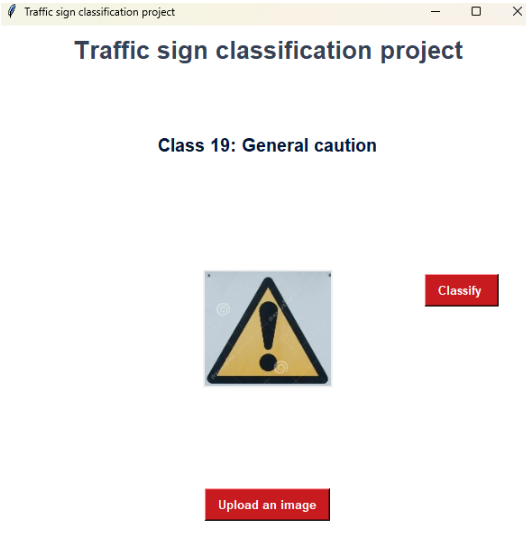

# Traffic Sign Classification

## Overview

This project implements a traffic sign classification model using deep learning. The dataset used is the **German Traffic Sign Recognition Benchmark (GTSRB)**, consisting of **43 classes** of traffic signs. The model is trained on local using **TensorFlow** and achieves high accuracy in recognizing traffic signs.

## Dataset

- **Dataset**: GTSRB (German Traffic Sign Recognition Benchmark) - small version
- **Number of classes**: 43
- **Images per class**: \~120
- **Format**: PPM (Portable Pixmap)

The dataset is already included in this repository under the data/ directory, so no additional download is needed.

## Installation

### Prerequisites

Ensure you have Python and the required dependencies installed:

```bash
pip install -r requirements.txt
```

### Running the Project

To train the model:

```bash
python ./src/traffic.py ./data/ model_name.h5
```

To run predict:

```bash
python ./gui/trafficsignGUI.py
```

## Results

The model successfully classifies traffic signs with high accuracy, demonstrating its effectiveness for real-world applications.

- **Accuracy**: 98.61%
- **Loss**: 0.0530

## Demo

You can test the model with new images:




